# Router Replay

Router Replay, or R3, records MoE router choices made during rollout generation
and replays those choices in Megatron forward passes. This keeps each generated
token's expert assignment consistent across rollout, logprob, and training
stages. Without replay, two valid router implementations can choose different
experts for the same token, which introduces train-vs-rollout logprob mismatch
that is unrelated to the policy update.

Router Replay is disabled by default. It is not needed for dense models. In
the current NeMo RL integration, Router Replay is wired and tested for
Megatron MoE policy training with vLLM rollout generation. Other
inference/generation backends are not wired into this path and have not been
tested with Router Replay.

## End-to-end behavior

The expert IDs are the only values replayed. Megatron still evaluates its
current router scores for those experts, executes its current expert weights,
and computes gradients normally. This removes the discontinuous backend
top-k mismatch without freezing the router or copying vLLM probabilities into
training.

```mermaid
flowchart LR
    Refit["Refit the same policy weights"]

    subgraph Rollout["Rollout / behavior policy: vLLM"]
        VHidden["Token hidden states"]
        VScores["vLLM router scores"]
        VTopK["vLLM top-k selection"]
        VExperts["Selected experts execute"]
        VLogprobs["generation_logprobs"]
        VRoutes["routed_experts<br/>token x MoE layer x top-k"]

        VHidden --> VScores --> VTopK --> VExperts --> VLogprobs
        VTopK --> VRoutes
    end

    subgraph Transport["NeMo RL rollout payload"]
        Messages["tokens + masks + generation_logprobs"]
        Routes["routed_experts<br/>encoded and batch-aligned"]
        ReplayBuffer["ReplayBuffer or TransferQueue"]

        Messages --> ReplayBuffer
        Routes --> ReplayBuffer
    end

    subgraph Alignment["Megatron route preparation"]
        Decode["Decode route tensor"]
        ParallelMap["Map global MoE layers to local PP layers<br/>and slice token rows for TP/SP/CP"]
        Validate{"Every route complete and valid?"}
        Install["Install expert IDs on each<br/>model-owned RouterReplay instance"]
        Fallback["All -1 row only:<br/>compute Megatron top-k for that row<br/>and emit fallback telemetry"]

        Decode --> ParallelMap --> Validate
        Validate -- "yes" --> Install
        Validate -- "missing sentinel" --> Fallback --> Install
    end

    subgraph Training["Policy backend: Megatron"]
        MWeights["Current Megatron policy weights"]
        MScores["Current Megatron router scores"]
        FixedTopK["Use replayed expert IDs<br/>instead of a new top-k decision"]
        Gather["Gather current scores for<br/>the replayed experts"]
        Prev["Prev-logprob forward"]
        PrevLP["prev_logprobs"]
        Train["Training forward"]
        Loss["GRPO loss / importance ratio"]
        Backward["Backward or activation recomputation<br/>replays the same expert IDs"]
        Update["Update router and expert parameters"]

        MWeights --> MScores --> FixedTopK --> Gather
        Gather --> Prev --> PrevLP
        Gather --> Train --> Loss --> Backward --> Update
        Install --> FixedTopK
        FixedTopK --> Backward
    end

    Refit --> VHidden
    Refit --> MWeights
    VLogprobs --> Messages
    VRoutes --> Routes
    ReplayBuffer --> Decode
    VLogprobs --> Compare["Generation-KL and<br/>token probability-error metrics"]
    PrevLP --> Compare

    Independent["Without R3: Megatron independently<br/>selects top-k; a boundary tie can choose<br/>different experts despite matched weights"]
    MScores -. "R3 disabled" .-> Independent -. "artificial mismatch" .-> Compare
```



The route tensor follows the generated tokens through the same packing and
transport transformations as the logprobs. Before a Megatron forward, NeMo RL
maps its global layer axis to the model's local pipeline stages and its token
axis to the relevant parallel shard. A missing route is represented only by an
all-`-1` sentinel row; that row falls back to Megatron's ordinary top-k while
the rest of the batch continues to replay vLLM's routes.

## Configuration

Set `policy.router_replay.enabled=true` in the training config:

```yaml
policy:
  router_replay:
    enabled: true
```

When Router Replay is enabled, NeMo RL configures vLLM rollout generation to
return routed expert indices by setting `enable_return_routed_experts=True` in
the vLLM kwargs. The generation payload is then carried through the normal
rollout and policy data path as the `routed_experts` field.

An example recipe is available at:

```text
examples/configs/recipes/llm/grpo-qwen3-30ba3b-8n8g-megatron-cp2-r3.yaml
```

The native async TransferQueue path uses the SingleController entrypoint with:

```text
examples/configs/recipes/llm/grpo-qwen3-30ba3b-10n8g-megatron-cp2-r3-async-single-controller.yaml
```

## Validation

Router Replay validation covers two end-to-end questions:

1. whether rollout routes are carried through TransferQueue, packing, context
   parallel slicing, and Megatron replay without changing token identity;
2. whether matched R3-on runs reduce train-vs-rollout mismatch relative to
   matched R3-off controls.

### Validation and Trace Debugging

Router Replay can emit JSONL traces for a small number of training steps. This
is intended for correctness debugging, not long training runs.

| Environment variable | Default | Meaning |
| --- | --- | --- |
| `NRL_ROUTER_REPLAY_VALIDATE` | `0` | Validate replay tensors before Megatron installs them, rejecting partially missing routes, duplicate top-k expert IDs, and out-of-range expert IDs. |
| `NRL_R3_TRACE` | `0` | Master switch for R3 JSONL trace emission. |
| `NRL_R3_TRACE_STEPS` | `1` | Number of training steps to trace. |
| `NRL_R3_TRACE_SAMPLES` | `2` | Number of samples with full tensor previews. |
| `NRL_R3_TRACE_DIR` | `logs/r3_trace` | Trace output directory. |
| `NRL_R3_TRACE_MICROBATCHES` | `2` | Number of microbatches to trace per stage. |
| `NRL_R3_TRACE_VERIFY_FORWARD` | `0` | Verifies replayed top-k indices against the installed replay tensor during forward. |

Example:

```bash
export NRL_R3_TRACE=1
export NRL_R3_TRACE_VERIFY_FORWARD=1
export NRL_R3_TRACE_STEPS=1
export NRL_R3_TRACE_SAMPLES=1
export NRL_R3_TRACE_MICROBATCHES=1
export NRL_R3_TRACE_DIR=/path/to/run/r3_trace
```

After the run, validate the emitted trace:

```bash
python tools/check_r3_trace.py /path/to/run/r3_trace \
  --require-forward-verify \
  --require-cp-identity
```

The checker verifies that:

- rollout payload samples include both `input_ids` and `routed_experts`;
- TransferQueue fetches match the rollout payload;
- context-parallel slicing preserves token identity for routed experts;
- Router Replay assignments are installed for prev-logprob and train stages;
- forward verification reports that replayed routes match the installed tensor.

### Effectiveness Check

1. Run matched R3-off controls to check that the PR does not regress existing
   packed-sequence and context-parallel Megatron training paths.
2. Run matched R3-on/R3-off pairs to measure whether Router Replay reduces
   train-vs-rollout mismatch under the intended rollout settings.

The main metrics to inspect are:

- `train/token_mult_prob_error`
- `train/js_divergence_error`

Validation report: <https://api.wandb.ai/links/nvidia-nemo-fw-public/lxoovk60>

## Other Notes

### Fallback for Missing Routes

In rare cases, vLLM can return fewer routed-expert entries than expected for a
sample. NeMo RL represents each missing token route with an all-`-1` sentinel.
Megatron then uses its normal router only for those missing token routes, while
all returned vLLM routes are still replayed exactly.

The fallback is intentionally route-local: it does not disable Router Replay for
the whole batch or sample.

When fallback is used, the vLLM worker emits a `R3 router replay fallback:` warning
to the run log naming the affected sample count and missing token-route count.
Fallback should normally be absent or rare; frequent warnings mean a meaningful
share of token routes used Megatron's normal router instead of replay.

The generation backend also computes
`r3/routed_experts_fallback_token_route_fraction`, but no training loop currently
forwards it to the metric logger, so do not rely on it in dashboards or gates.
